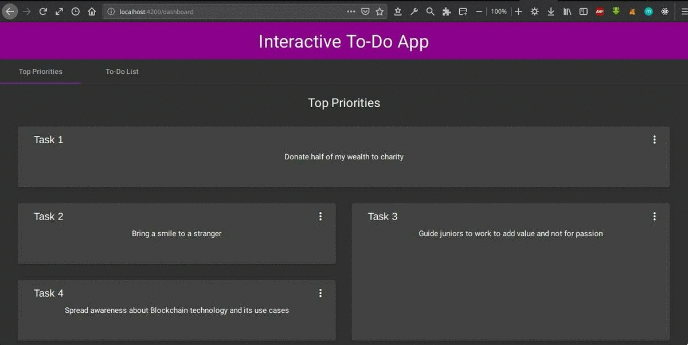

# Interactive To-Do App
An interactive to-do application, created using Angular and its Material Design, that helps you prioritize your tasks

### Prerequisite
Node.js version 10.15.3

### Steps to launch app locally

1. On your terminal, type the following to clone this repository: `https://github.com/smitrajput/Interactive_To-Do.git`
2. Change into the project directory:    
`cd Interactive_To-Do`
3. Install the dependencies:    
`npm install`
4. Launch the app   
`ng serve --open`
5. You will be automatically redirected to `localhost:4200/` in your browser

### App Demo

#### TL;DR

#### To be more specific,
The Dashboard  :tada: :tada: :tada: 

This is the page(also the *Top Priorities* tab), where your top 4 priorities will be displayed

You can remove a priority

After which, the top 4 will rearrange themselves according to the original list

And, **this** is the original list, in the *To-Do List*  tab

You can *Add* new tasks to the list   List before:

List after:

You can *Remove* tasks from the list   List before: 

List after:

This will also bring changes to the *Top Priorities*

You can also rearrange your tasks by *dragging and dropping* them at appropriate positions

That's it. Please give a  :star: if you liked the minimalistic app.

### Author
Smit Rajput  
[![alt text][1.1]][1]
[![alt text][6.1]][6]

<!-- links to social media icons -->
<!-- no need to change these -->

<!-- icons with padding -->

[1.1]: http://i.imgur.com/tXSoThF.png (@smit_rajput19)
[6.1]: http://i.imgur.com/0o48UoR.png (/smitrajput)

<!-- links to your social media accounts -->
<!-- update these accordingly -->

[1]: http://www.twitter.com/smit_rajput19
[6]: http://www.github.com/smitrajput

